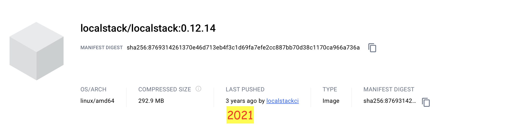

# Localstack 0.12.14

**Definisi localstack.**  
LocalStack adalah sebuah alat pengembangan perangkat lunak open-source yang menyediakan lingkungan simulasi awan lokal untuk pengembangan dan pengujian aplikasi cloud. Ini memungkinkan pengembang untuk membuat replika lingkungan cloud di mesin lokal mereka, memungkinkan pengembangan dan pengujian aplikasi tanpa perlu terhubung ke layanan cloud yang sebenarnya.

&nbsp;

    
    
URL : https://hub.docker.com/layers/localstack/localstack/0.12.14/images/sha256-8769314261370e46d713eb4f3c1d69fa7efe2cc887bb70d38c1170ca966a736a?context=explore

 

&nbsp;

&nbsp;

### &#x1F530; Start Deployment in docker compose.

&nbsp;

<pre>
    ❯ ccat docker-compose.yml

            version: '3.7'
            
            services:
              localstack:
                image: localstack/localstack:0.12.14
                container_name: localstack_s3
                network_mode: bridge
                environment:
                  - DOCKER_HOST=unix:///var/run/docker.sock
                  - SERVICES=lambda,s3
                  - EDGE_PORT=4566
                  - PERSISTENCE=1
                  #- DEBUG=1
                  #- LS_LOG=trace
                  - DATA_DIR=/tmp/localstack
                  #- AWS_DEFAULT_REGION=ap-southeast-3
                ports:
                  - "4566:4566"
                volumes:
                  - ./localstack/localstack_data:/tmp/localstack
                  - ./localstack/localstack_libraries:/usr/lib/localstack    # static third-party packages installed into the container images
                  - ./localstack/localstack_root:/var/lib/localstack         # the LocalStack volume directory root
                  - "/var/run/docker.sock:/var/run/docker.sock"
</pre>

&nbsp;

Build.
<pre>
    ❯ docker-compose up

        [+] Running 1/0
        ⠿ Container localstack_s3  Created                                                                                             0.0s
        Attaching to localstack_s3
        localstack_s3  | Waiting for all LocalStack services to be ready
        localstack_s3  | 2024-03-29 16:21:35,081 CRIT Supervisor is running as root.  Privileges were not dropped because no user is specified in the config file.  If you intend to run as root, you can set user=root in the config file to avoid this message.
        localstack_s3  | 2024-03-29 16:21:35,090 INFO supervisord started with pid 30
        localstack_s3  | 2024-03-29 16:21:36,116 INFO spawned: 'dashboard' with pid 48
        localstack_s3  | 2024-03-29 16:21:36,130 INFO spawned: 'infra' with pid 50
        localstack_s3  | 2024-03-29 16:21:36,190 INFO success: dashboard entered RUNNING state, process has stayed up for > than 0 seconds (startsecs)
        localstack_s3  | 2024-03-29 16:21:36,192 INFO exited: dashboard (exit status 0; expected)
        localstack_s3  | (. .venv/bin/activate; exec bin/localstack start --host)
        localstack_s3  | 2024-03-29 16:21:37,201 INFO success: infra entered RUNNING state, process has stayed up for > than 1 seconds (startsecs)
        localstack_s3  | Starting local dev environment. CTRL-C to quit.
        localstack_s3  | Waiting for all LocalStack services to be ready
        localstack_s3  | Waiting for all LocalStack services to be ready
        localstack_s3  | Waiting for all LocalStack services to be ready
        localstack_s3  | 
        localstack_s3  | LocalStack version: 0.12.14
        localstack_s3  | LocalStack build date: 2021-07-02
        localstack_s3  | LocalStack build git hash: 8c006f12
        localstack_s3  | 
        localstack_s3  | 2024-03-29T16:21:55:DEBUG:bootstrap.py: Loading plugins - scope "services", module "localstack": <function register_localstack_plugins at 0x4004a0d830>
        localstack_s3  | Starting edge router (https port 4566)...
        localstack_s3  | Starting mock CloudWatch service on http port 4566 ...
        localstack_s3  | 2024-03-29T16:21:56:INFO:localstack.utils.analytics.profiler: Execution of "load_plugin_from_path" took 715.11ms
        localstack_s3  | 2024-03-29T16:21:56:INFO:localstack.utils.analytics.profiler: Execution of "load_plugins" took 716.31ms
        localstack_s3  | 2024-03-29T16:21:56:INFO:localstack.multiserver: Starting multi API server process on port 58297
        localstack_s3  | [2024-03-29 16:21:56 +0000] [54] [INFO] Running on http://0.0.0.0:58297 (CTRL + C to quit)
        localstack_s3  | [2024-03-29 16:21:56 +0000] [54] [INFO] Running on https://0.0.0.0:4566 (CTRL + C to quit)
        localstack_s3  | 2024-03-29T16:21:56:INFO:hypercorn.error: Running on http://0.0.0.0:58297 (CTRL + C to quit)
        localstack_s3  | 2024-03-29T16:21:56:INFO:hypercorn.error: Running on https://0.0.0.0:4566 (CTRL + C to quit)
        localstack_s3  | 2024-03-29 16:21:57,914:API:  * Running on all addresses.
        localstack_s3  |    WARNING: This is a development server. Do not use it in a production deployment.
        localstack_s3  | Starting mock Lambda service on http port 4566 ...
        localstack_s3  | Starting mock CloudWatch Logs service on http port 4566 ...
        localstack_s3  | Starting mock S3 service on http port 4566 ...
        localstack_s3  | 2024-03-29 16:21:57,935:API:  * Running on http://172.17.0.2:43635/ (Press CTRL+C to quit)
        localstack_s3  | Waiting for all LocalStack services to be ready
        localstack_s3  | 2024-03-29T16:22:03:DEBUG:localstack.services.edge: IN(s3): "GET /" - headers: {'Remote-Addr': '127.0.0.1', 'Host': 's3.localhost.localstack.cloud:4566', 'Accept-Encoding': 'identity', 'User-Agent': 'Boto3/1.17.104 Python/3.7.10 Linux/5.10.104-linuxkit Botocore/1.20.104', 'X-Amz-Date': '20240329T162203Z', 'X-Amz-Content-Sha256': 'e3b0c44298fc1c149afbf4c8996fb92427ae41e4649b934ca495991b7852b855', 'Authorization': 'AWS4-HMAC-SHA256 Credential=__internal_call__/20240329/ap-southeast-3/s3/aws4_request, SignedHeaders=host;x-amz-content-sha256;x-amz-date, Signature=380bc6497202415cc09095204f333398a9c62192b256665967703100ed47a907', 'X-Forwarded-For': '127.0.0.1, s3.localhost.localstack.cloud:4566', 'x-localstack-edge': 'http://s3.localhost.localstack.cloud:4566'} - data: b''
        localstack_s3  | Waiting for all LocalStack services to be ready
        localstack_s3  | Waiting for all LocalStack services to be ready
        localstack_s3  | Ready.
        localstack_s3  | 2024-03-29T16:22:22:DEBUG:localstack.services.edge: OUT(s3): "GET /" - status: 200 - response headers: {'Content-Type': 'application/xml; charset=utf-8', 'Access-Control-Allow-Origin': '*', 'Server': 'Werkzeug/2.0.1 Python/3.7.10', 'Date': 'Fri, 29 Mar 2024 16:22:22 GMT', 'Last-Modified': 'Fri, 29 Mar 2024 16:22:22 GMT', 'x-amz-request-id': '8C65748B0F995210', 'x-amz-id-2': 'MzRISOwyjmnup8C65748B0F9952107/JypPGXLh0OVFGcJaaO3KW/hRAqKOpIEEp', 'accept-ranges': 'bytes', 'content-language': 'en-US', 'Transfer-Encoding': 'chunked'} - response: <ListAllMyBucketsResult xmlns="http://s3.amazonaws.com/doc/2006-03-01"><Owner><ID>bcaf1ffd86f41161ca5fb16fd081034f</ID><DisplayName>webfile</DisplayName></Owner><Buckets></Buckets></ListAllMyBucketsResult>
        localstack_s3  | 2024-03-29T16:22:22:INFO:localstack.utils.analytics.profiler: Execution of "start_api_services" took 25466.38ms
</pre>

&nbsp;

File structure of the mounting directory.
<pre>
    ❯ tree -L 5 -a -I 'README.md|.DS_Store' ./localstack
        ├── localstack_config
        ├── localstack_data
        │   ├── recorded_api_calls.json
        │   ├── server.test.pem
        │   ├── server.test.pem.crt
        │   └── server.test.pem.key
        ├── localstack_libraries
        └── localstack_root

        4 directories, 4 files
</pre>

&nbsp;

&nbsp;

### &#x1F530; Testing with experimental stages.

- &#x2705; Command into the container.

        ❯ docker exec -it localstack_s3 /bin/bash

    <pre>
        # create bucket.
        ❯ awslocal s3 mb s3://testbucket
            make_bucket: testbucket

        # list buckets.
        ❯ awslocal s3 ls
            2024-03-29 16:28:43 testbucket
    </pre>

- &#x2705; Command used outside the container.
    <pre>
        ❯ exit
    </pre>
    <pre>
    # upload object
    ❯ aws --endpoint-url=http://localhost:4566 s3 cp ./tank.png s3://testbucket/tank.png
        upload: ./tank.png to s3://testbucket/tank.png

    # list objects
    ❯ aws --endpoint-url=http://localhost:4566 s3 ls s3://testbucket/ 
        2024-03-30 03:16:20      25600 tank.png
    </pre>

&nbsp;

**Restart docker compose:**

<pre>

    ❯ docker-compose restart localstack
        [+] Running 1/1
        ⠿ Container localstack_s3  Started  

    # list of files in the bucket
    ❯ aws --endpoint-url=http://localhost:4566 s3 ls s3://testbucket/
        2024-03-30 03:22:49      25600 tank.png

    # remove bucket
    ❯ aws --endpoint-url=http://localhost:4566 s3 rb s3://testbucket --force

        remove_bucket: testbucket

</pre>

&nbsp;

&nbsp;

---

&nbsp;

&nbsp;

### &#x1F530; Testing with experimental stages (AWS CLI s3api ).

Request sample.
<pre>
    ❯ aws s3api create-bucket \
        --profile YOUR_PROFILE \
        --bucket BUCKET \
        --endpoint https://oos.eu-west-2.outscale.com
</pre>
<pre>
    ❯ aws s3api create-bucket --bucket test-bucket-001-b --endpoint http://localhost:4566
        {
            "Location": "/test-bucket-001-b"
        }    
</pre>

&nbsp;

Request sample.
<pre>
    ❯ aws s3api list-buckets \
        --profile YOUR_PROFILE \
        --endpoint https://oos.eu-west-2.outscale.com
</pre>
<pre>
    ❯ aws s3api list-buckets --endpoint http://localhost:4566
        {
            "Buckets": [
                {
                    "Name": "test-bucket-001-b",
                    "CreationDate": "2024-03-30T03:40:54+00:00"
                }
            ],
            "Owner": {
                "DisplayName": "webfile",
                "ID": "bcaf1ffd86f41161ca5fb16fd081034f"
            }
        }    
</pre>

&nbsp;

Request sample.
<pre>
    ❯ aws s3api put-object \
        --profile YOUR_PROFILE \
        --bucket BUCKET \
        --key OBJECT \
        --body usr/bin/YOUR_OBJECT \
        --acl private \
        --content-length 42 \
        --grant-full-control "id=USER_ID, id=USER_ID" \
        --grant-read "id=USER_ID, id=USER_ID" \
        --grant-read-acp "id=USER_ID, id=USER_ID" \
        --grant-write-acp "id=USER_ID, id=USER_ID" \
        --endpoint https://oos.eu-west-2.outscale.com
</pre>
<pre>
    ❯ aws s3api put-object --bucket test-bucket-001-b --key tank.png --body ./tank.png --endpoint http://localhost:4566
        {
            "ETag": "\"ecdcc986fca929f13c8d36cf804d1e1c\""
        }    
</pre>

&nbsp;

Request sample.
<pre>
    ❯ aws s3api list-objects-v2 \
        --profile YOUR_PROFILE \
        --bucket BUCKET \
        --prefix "bank-data/2023/" \
        --delimiter "/" \
        --encoding-type url \
        --fetch-owner \
        --start-after NOT_SPECIFIED \
        --page-size 100 \
        --max-items 500 \
        --endpoint https://oos.eu-west-2.outscale.com
</pre>
<pre>
    ❯ aws s3api list-objects --bucket test-bucket-001-b --endpoint http://localhost:4566
        {
            "Contents": [
                {
                    "Key": "tank.png",
                    "LastModified": "2024-03-30T03:55:20+00:00",
                    "ETag": "\"ecdcc986fca929f13c8d36cf804d1e1c\"",
                    "Size": 25600,
                    "StorageClass": "STANDARD",
                    "Owner": {
                        "DisplayName": "webfile",
                        "ID": "75aa57f09aa0c8caeab4f8c24e99d10f8e7faeebf76c078efc7c6caea54ba06a"
                    }
                }
            ]
        }    
</pre>

&nbsp;

Request sample.
<pre>
    ❯ aws s3api get-bucket-cors \
        --profile YOUR_PROFILE \
        --bucket BUCKET \
        --endpoint https://oos.eu-west-2.outscale.com
</pre>
<pre>
    ❯ aws s3api get-bucket-cors --bucket test-bucket-001-b --endpoint http://localhost:4566
        An error occurred (NoSuchCORSConfiguration) when calling the GetBucketCors operation: The CORS configuration does not exist
</pre>

&nbsp;

Applying a CORS Configuration to a Bucket Using AWS CLI
<pre>
    ❯ touch my_cors-config.json

    ❯ vim my_cors-config.json
        . . .
        {
            "CORSRules": [
            {
                "AllowedHeaders": ["Authorization"],
                "AllowedMethods": ["GET"],
                "AllowedOrigins": ["http://localhost:4566"],
                "MaxAgeSeconds": 3000
            }
            ]
        }
</pre>

&nbsp;

To apply a CORS configuration to a bucket, use the put-bucket-cors command following this syntax:
<pre>
    ❯ aws s3api put-bucket-cors \
        --profile YOUR_PROFILE \
        --bucket BUCKET \
        --cors-configuration file://MY_CORS_CONFIG.json \
        --endpoint https://oos.eu-west-2.outscale.com
</pre>
<pre>
    ❯ aws s3api put-bucket-cors --bucket test-bucket-001-b \
            --cors-configuration file:////Users/powercommerce/Documents/test/from-github-all/localstack-old-version-service-s3-docker-compose/localstack-0.12.14/my_cors-config.json \
            --endpoint http://localhost:4566
</pre>
<pre>
    ❯ aws s3api get-bucket-cors --bucket test-bucket-001-b --endpoint http://localhost:4566
        {
            "CORSRules": [
                {
                    "AllowedHeaders": [
                        "Authorization"
                    ],
                    "AllowedMethods": [
                        "GET"
                    ],
                    "AllowedOrigins": [
                        "http://localhost:4566"
                    ],
                    "MaxAgeSeconds": 3000
                }
            ]
        }    
</pre>

&nbsp;

&nbsp;

&nbsp;

&nbsp;

### &#x1F530; Conclusion.

The buckets and object data still exist after the container is restarted.

&nbsp;

&nbsp;

&nbsp;

### Notes:

- Reference:  
    <pre>https://github.com/rayhaanbhikha/localstack-s3-ui</pre>

&nbsp;

---

&nbsp;

    

 

&nbsp;

---

&nbsp;

&nbsp;