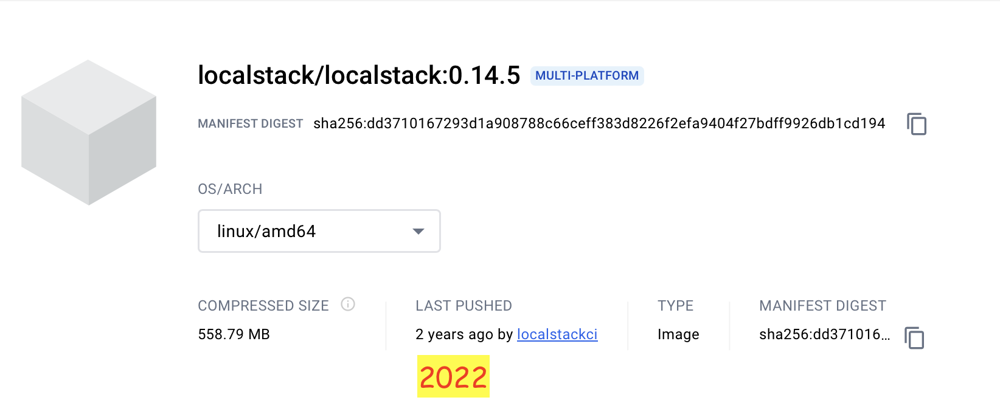

# Localstack 0.14.5

**Definisi localstack.**  
LocalStack adalah sebuah alat pengembangan perangkat lunak open-source yang menyediakan lingkungan simulasi awan lokal untuk pengembangan dan pengujian aplikasi cloud. Ini memungkinkan pengembang untuk membuat replika lingkungan cloud di mesin lokal mereka, memungkinkan pengembangan dan pengujian aplikasi tanpa perlu terhubung ke layanan cloud yang sebenarnya.

&nbsp;

    
    
URL : https://hub.docker.com/layers/localstack/localstack/0.14.5/images/sha256-dd3710167293d1a908788c66ceff383d8226f2efa9404f27bdff9926db1cd194?context=explore

 

&nbsp;

&nbsp;

### &#x1F530; Start Deployment in docker compose.

&nbsp;

<pre>
    ❯ ccat docker-compose.yml

            version: '3.7'
            
            services:
              localstack:
                image: localstack/localstack:0.14.5
                container_name: localstack_s3
                network_mode: bridge
                environment:
                  - DOCKER_HOST=unix:///var/run/docker.sock
                  - SERVICES=lambda,s3
                  - EDGE_PORT=4566
                  - PERSISTENCE=1
                  #- DEBUG=1
                  #- LS_LOG=trace
                  - DATA_DIR=/tmp/localstack
                  #- AWS_DEFAULT_REGION=ap-southeast-3
                ports:
                  - "4566:4566"
                volumes:
                  - ./localstack/localstack_data:/tmp/localstack
                  - ./localstack/localstack_libraries:/usr/lib/localstack    # static third-party packages installed into the container images
                  - ./localstack/localstack_root:/var/lib/localstack         # the LocalStack volume directory root
                  - "/var/run/docker.sock:/var/run/docker.sock"
</pre>

&nbsp;

Build.
<pre>
    ❯ docker-compose up

        [+] Running 1/1
        ⠿ Container localstack_s3  Created                                                                                                                                                0.3s
        Attaching to localstack_s3
        localstack_s3  | Waiting for all LocalStack services to be ready
        localstack_s3  | 2024-03-30 01:14:17,606 CRIT Supervisor is running as root.  Privileges were not dropped because no user is specified in the config file.  If you intend to run as root, you can set user=root in the config file to avoid this message.
        localstack_s3  | 2024-03-30 01:14:17,607 INFO supervisord started with pid 16
        localstack_s3  | 2024-03-30 01:14:18,615 INFO spawned: 'infra' with pid 21
        localstack_s3  | 
        localstack_s3  | LocalStack version: 0.14.5
        localstack_s3  | 2024-03-30 01:14:20,473 INFO success: infra entered RUNNING state, process has stayed up for > than 1 seconds (startsecs)
        localstack_s3  | LocalStack Docker container id: cbf952a202b2
        localstack_s3  | LocalStack build date: 2022-07-08
        localstack_s3  | LocalStack build git hash: db54501d
        localstack_s3  | 
        localstack_s3  | Starting edge router (https port 4566)...
        localstack_s3  | [2024-03-30 01:14:20 +0000] [21] [INFO] Running on https://0.0.0.0:4566 (CTRL + C to quit)
        localstack_s3  | 2024-03-30T01:14:20.472:INFO:hypercorn.error: Running on https://0.0.0.0:4566 (CTRL + C to quit)
        localstack_s3  | 2024-03-30T01:14:20.498:INFO:bootstrap.py: Execution of "start_runtime_components" took 942.75ms
        localstack_s3  | Ready.
        localstack_s3  | 2024-03-30T01:14:20.538:WARNING:localstack.services.infra: Persistence mechanism for community services (based on API calls record&replay) will be deprecated in versions 0.13.0 and above

</pre>

&nbsp;

File structure of the mounting directory.
<pre>
    ❯ tree -L 5 -a -I 'README.md|.DS_Store' ./localstack
        ├── localstack_config
        ├── localstack_data
        │   ├── recorded_api_calls.json
        │   └── startup_info.json
        ├── localstack_libraries
        └── localstack_root
            ├── cache
            │   ├── machine.json
            │   ├── server.test.pem
            │   ├── server.test.pem.crt
            │   └── server.test.pem.key
            ├── logs
            └── var_libs

        7 directories, 6 files
</pre>

&nbsp;

&nbsp;

### &#x1F530; Testing with experimental stages.

- &#x2705; Command into the container.

        ❯ docker exec -it localstack_s3 /bin/bash

    <pre>
        # create bucket.
        ❯ awslocal s3 mb s3://testbucket
            make_bucket: testbucket

        # list buckets.
        ❯ awslocal s3 ls
            2024-03-29 16:28:43 testbucket
    </pre>

- &#x2705; Command used outside the container.
    <pre>
        ❯ exit
    </pre>
    <pre>
    # upload object
    ❯ aws --endpoint-url=http://localhost:4566 s3 cp ./tank.png s3://testbucket/tank.png
        upload: ./tank.png to s3://testbucket/tank.png

    # list objects
    ❯ aws --endpoint-url=http://localhost:4566 s3 ls s3://testbucket/ 
        2024-03-30 03:16:20      25600 tank.png
    </pre>

&nbsp;

**Restart docker compose:**

<pre>

    ❯ docker-compose restart localstack
        [+] Running 1/1
        ⠿ Container localstack_s3  Started  

    # list of files in the bucket
    ❯ aws --endpoint-url=http://localhost:4566 s3 ls s3://testbucket/
        2024-03-30 03:22:49      25600 tank.png

    # remove bucket
    ❯ aws --endpoint-url=http://localhost:4566 s3 rb s3://testbucket --force

        remove_bucket: testbucket

</pre>

&nbsp;

&nbsp;

### &#x1F530; Conclusion.

&nbsp;

&nbsp;

---

&nbsp;

    

 

&nbsp;

---

&nbsp;

&nbsp;