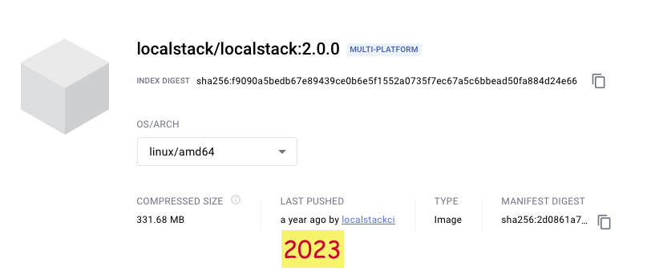

# Localstack 2.0.0

**Definisi localstack.**  
LocalStack adalah sebuah alat pengembangan perangkat lunak open-source yang menyediakan lingkungan simulasi awan lokal untuk pengembangan dan pengujian aplikasi cloud. Ini memungkinkan pengembang untuk membuat replika lingkungan cloud di mesin lokal mereka, memungkinkan pengembangan dan pengujian aplikasi tanpa perlu terhubung ke layanan cloud yang sebenarnya.

&nbsp;

    
    
URL : https://hub.docker.com/layers/localstack/localstack/2.0.0/images/sha256-2d0861a7fd281bb4f8a8404d8249ab4aed278c5ac8bdc55f8c246399e4bffcb8?context=explore

 

&nbsp;

&nbsp;

### &#x1F530; Start Deployment in docker compose.

&nbsp;

<pre>
    ❯ ccat docker-compose.yml

            version: '3.7'
            
            services:
              localstack:
                image: localstack/localstack:2.0.0
                container_name: localstack_s3
                network_mode: bridge
                environment:
                  - DOCKER_HOST=unix:///var/run/docker.sock
                  - SERVICES=lambda,s3
                  - EDGE_PORT=4566
                  - PERSISTENCE=1
                  #- DEBUG=1
                  #- LS_LOG=trace
                  - DATA_DIR=/tmp/localstack
                  #- AWS_DEFAULT_REGION=ap-southeast-3
                ports:
                  - "4566:4566"
                volumes:
                  - ./localstack/localstack_data:/tmp/localstack
                  - ./localstack/localstack_libraries:/usr/lib/localstack    # static third-party packages installed into the container images
                  - ./localstack/localstack_root:/var/lib/localstack         # the LocalStack volume directory root
                  - "/var/run/docker.sock:/var/run/docker.sock"
</pre>

&nbsp;

Build.
<pre>
    ❯ docker-compose up

</pre>

&nbsp;

File structure of the mounting directory.
<pre>
    ❯ tree -L 5 -a -I 'README.md|.DS_Store' ./localstack
 
</pre>

&nbsp;

&nbsp;

### &#x1F530; Testing with experimental stages.

- &#x2705; Command into the container.

        ❯ docker exec -it localstack_s3 /bin/bash

    <pre>
        # create bucket.
        ❯ awslocal s3 mb s3://testbucket
            make_bucket: testbucket

        # list buckets.
        ❯ awslocal s3 ls
            2024-03-30 01:44:01 testbucket
    </pre>

- &#x2705; Command used outside the container.
    <pre>
        ❯ exit
    </pre>
    <pre>
    # upload object
    ❯ aws --endpoint-url=http://localhost:4566 s3 cp ./tank.png s3://testbucket/tank.png
        upload: ./tank.png to s3://testbucket/tank.png

    # list objects
    ❯ aws --endpoint-url=http://localhost:4566 s3 ls s3://testbucket/ 
        2024-03-30 08:44:45      25600 tank.png
    </pre>

&nbsp;

**Restart docker compose:**

<pre>

    ❯ docker-compose restart localstack
        [+] Running 1/1
        ⠿ Container localstack_s3  Started  

    # list of files in the bucket
    ❯ aws --endpoint-url=http://localhost:4566 s3 ls s3://testbucket/
        2024-03-30 08:45:18      25600 tank.png

    # remove bucket
    ❯ aws --endpoint-url=http://localhost:4566 s3 rb s3://testbucket --force

        remove_bucket: testbucket

</pre>

&nbsp;

&nbsp;

### &#x1F530; Conclusion.

The buckets and object data still exist after the container is restarted.

&nbsp;

&nbsp;

---

&nbsp;

    

 

&nbsp;

---

&nbsp;

&nbsp;